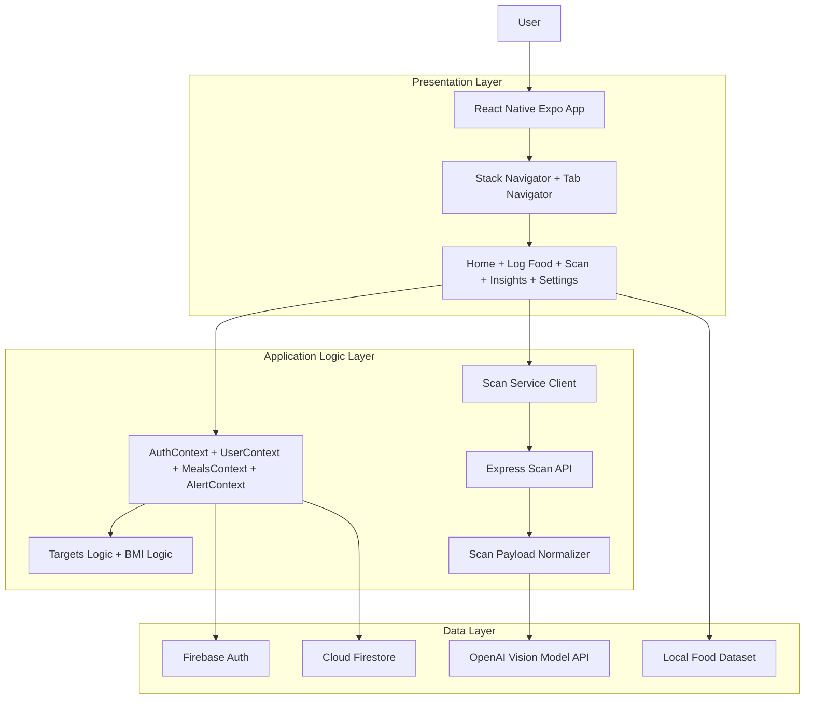
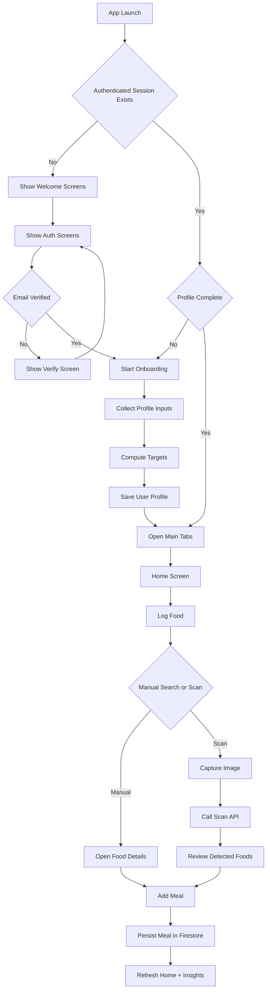
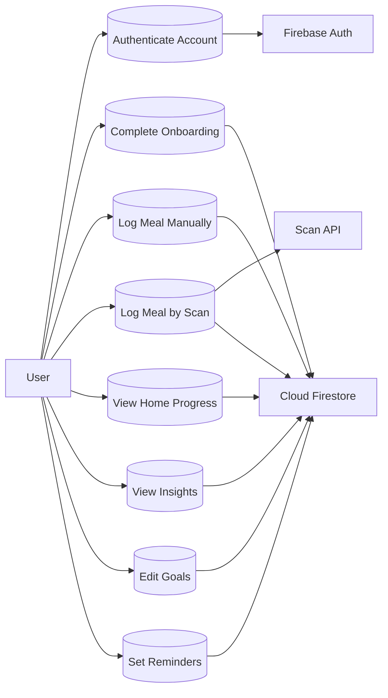
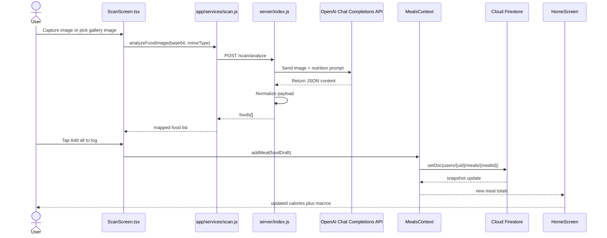

# MetaCal System Requirements and Architecture

## 1. Functional Requirements

- FR-01: The system shall display three welcome screens.
- FR-02: The system shall allow user registration through email.
- FR-03: The system shall send an email verification link after registration.
- FR-04: The system shall block app access before email verification.
- FR-05: The system shall allow user login through email.
- FR-06: The system shall allow password reset through email.
- FR-07: The system shall capture user name during onboarding.
- FR-08: The system shall capture user gender during onboarding.
- FR-09: The system shall capture user age during onboarding.
- FR-10: The system shall capture user height during onboarding.
- FR-11: The system shall capture user current weight during onboarding.
- FR-12: The system shall capture user target weight during onboarding.
- FR-13: The system shall capture user goal during onboarding.
- FR-14: The system shall capture user activity level during onboarding.
- FR-15: The system shall compute calorie target from profile data.
- FR-16: The system shall compute macro targets from profile data.
- FR-17: The system shall store user profile data in Firestore.
- FR-18: The system shall store meal entries in Firestore.
- FR-19: The system shall display daily calorie progress on the home screen.
- FR-20: The system shall display protein progress on the home screen.
- FR-21: The system shall display carbohydrate progress on the home screen.
- FR-22: The system shall display fat progress on the home screen.
- FR-23: The system shall support manual food search from local food data.
- FR-24: The system shall support meal logging from food details.
- FR-25: The system shall support meal deletion from the home screen.
- FR-26: The system shall support food scan through camera capture.
- FR-27: The system shall support food scan through gallery image.
- FR-28: The system shall call backend scan API for image analysis.
- FR-29: The system shall map scan results to local nutrition data when available.
- FR-30: The system shall display daily insights for calories.
- FR-31: The system shall display daily insights for macros.
- FR-32: The system shall display weight insights.
- FR-33: The system shall display BMI value.
- FR-34: The system shall display BMI category.
- FR-35: The system shall support monthly insights view.
- FR-36: The system shall allow macro goal edits from settings.
- FR-37: The system shall allow personal detail edits from settings.
- FR-38: The system shall save notification preference settings.
- FR-39: The system shall display health education articles.

## 2. Non-Functional Requirements

- NFR-01: The app shall render on Android devices.
- NFR-02: The app shall render on iOS devices.
- NFR-03: The app shall use persistent auth state across sessions.
- NFR-04: The app shall protect API keys through server-side storage.
- NFR-05: The app shall use HTTPS for backend requests.
- NFR-06: The app shall handle network failure through user-facing messages.
- NFR-07: The app shall handle invalid scan payloads through safe parsing.
- NFR-08: The app shall use real-time Firestore listeners for meal updates.
- NFR-09: The app shall keep navigation response within interactive speed.
- NFR-10: The app shall keep UI readability through consistent typography.
- NFR-11: The app shall keep component spacing through a consistent layout grid.
- NFR-12: The app shall keep code modular through Context providers.
- NFR-13: The app shall support cloud deployment for backend API.
- NFR-14: The app shall support environment-based API base URL switching.

## 3. System Architecture Overview

MetaCal uses a three-layer architecture. The mobile client handles interface rendering. Context providers handle state transitions. Firebase services handle identity plus persistence. The scan backend handles AI analysis requests.

### 3.1 Presentation Layer

The Presentation Layer is the React Native Expo app UI.

Core elements:
- Screen modules in `app/screens/*`
- Navigation container in `app/index.tsx`
- Stack navigation for onboarding plus auth flow
- Bottom tab navigation for Home, Insights, Articles, Account
- Reusable text component in `app/components/MetaText.js`
- Alert presentation through `AlertContext`

### 3.2 Application (Logic) Layer

The Application Layer contains client logic plus backend API logic.

Client logic modules:
- `AuthContext` for auth session state
- `UserContext` for profile state
- `MealsContext` for meal stream plus write operations
- `targets.js` for calorie plus macro calculations
- `utils/health.js` for BMI computation plus category mapping
- `services/scan.js` for scan API request handling
- `config/api.js` for runtime API base URL resolution

Backend logic modules:
- `server/index.js` Express API
- `/scan/analyze` endpoint
- OpenAI request building plus response normalization
- Schema validation plus payload clamping

### 3.3 Data Layer

The Data Layer contains Firebase plus local nutrition datasets.

Data stores:
- Firebase Authentication for account identity
- Firestore document `users/{uid}` for profile plus targets plus settings
- Firestore subcollection `users/{uid}/meals` for meal logs
- Local Nigerian food dataset in `app/data/nigeriaFoods.js`
- Local WAFCT-derived file in `app/data/wafctFoods.json`

### 3.4 Architecture Diagram

### 3.5 Calorie Calculation Formula

MetaCal computes daily calorie target with the Mifflin-St Jeor method, activity multiplier, and goal adjustment.

For male users:

\[
BMR = 10W + 6.25H - 5A + 5
\]

For female users:

\[
BMR = 10W + 6.25H - 5A - 161
\]

Where:
- \(W\) = weight in kg
- \(H\) = height in cm
- \(A\) = age in years

Then:

\[
TDEE = BMR \times ActivityMultiplier
\]

Goal adjustment:
- Weight loss: \(-300\) kcal
- Maintenance: \(0\) kcal
- Weight gain: \(+300\) kcal

Final calorie target:

\[
Calories = \max(1200,\; round(TDEE + GoalAdjustment))
\]

### 3.6 Full Meaning and Significance of Terms

| Term | Full Meaning | Significance in MetaCal |
|---|---|---|
| BMR | Basal Metabolic Rate | Defines minimum daily energy need at rest. |
| TDEE | Total Daily Energy Expenditure | Defines estimated daily energy need after activity level scaling. |
| W | Weight in kilograms | Drives BMR value plus macro target values. |
| H | Height in centimeters | Drives BMR value plus BMI value. |
| A | Age in years | Drives BMR value through metabolic age factor. |
| Activity Multiplier | Activity factor from selected activity level | Converts BMR into TDEE based on lifestyle intensity. |
| Goal Adjustment | Calorie offset from selected goal | Creates deficit for loss goal or surplus for gain goal. |
| Calories | Final daily energy target in kilocalories | Controls ring progress plus daily intake guidance. |
| kcal | Kilocalorie unit | Standard energy unit for food plus targets. |
| BMI | Body Mass Index | Classifies body mass status from weight plus height. |
| Protein | Daily protein target in grams | Supports muscle retention plus recovery tracking. |
| Carbohydrates | Daily carbohydrate target in grams | Supports energy availability tracking. |
| Fat | Daily fat target in grams | Supports hormone health plus satiety tracking. |
| FR | Functional Requirement | Defines a required app behavior. |
| NFR | Non-Functional Requirement | Defines required quality constraints. |

## 4. Flowchart Diagram

## 5. Use Case Diagram

## 6. Sequence Diagram for Food Scanning

## 7. Programming Tools

| Category | Tools Used | Purpose |
|---|---|---|
| Frontend | React Native, Expo, Expo Router entry runtime, React Navigation, Expo Camera, Expo Image Picker, React Native SVG | Mobile UI, navigation, camera capture, chart rendering |
| Backend | Node.js, Express, CORS, dotenv | Scan endpoint, request validation, environment config |
| Database | Firebase Authentication, Cloud Firestore | Identity, profile storage, meal storage |
| AI Tools | OpenAI Chat Completions API (`gpt-4o-mini` default) | Meal image analysis, food item extraction, macro estimation |
| Development Tools | npm, ESLint, TypeScript support, Metro bundler | Local development, linting, build pipeline |
| Collaboration Tools | Git, GitHub | Version control, remote collaboration, code hosting |
| Deployment Tools | Render (backend API), EAS Build (Android APK pipeline) | Backend hosting, mobile artifact generation |
